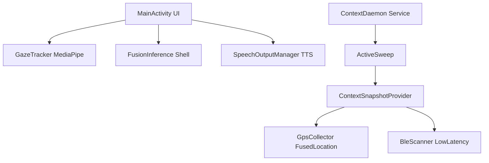

# Implementation Plan - AACBridge Android App Layer Integration

This document outlines the design and implementation strategy for building and integrating the Android app-layer components for **AACBridge**. 

The goal is to seamlessly connect the Android application environment (GPS, Bluetooth, Camera, and UI) with the existing stable native/JNI backend designed by Arjit. We will not modify the native/C++ code or rewrite backend concurrency/scoring/caching logic.

---

## Goal Description

Integrate the Android app layer with the pre-existing, stable native backend systems. The app layer is responsible for:
1. **Context Collection**: High-fidelity GPS and BLE acquisition.
2. **ContextDaemon Wiring**: Orchestrating periodic background context updates.
3. **MediaPipe Gaze Tracking**: Setting up Face Mesh gaze tracking with a 400ms dwell threshold and visual fixation target mapping.
4. **Fusion Shell**: A lightweight integration shell combining eye gaze with EMG classification embeddings.
5. **UI Layer & TTS**: Lightweight, low-latency layout UI with intent controls, fallback indicators, debug logs, and Text-to-Speech (TTS) readout.

---

## User Review Required

We propose to add two external libraries to the project to fulfill our requirements:
1. **Google Play Services Location**: `com.google.android.gms:play-services-location:21.2.0` — Required for modern, power-balanced `FusedLocationProviderClient`.
2. **MediaPipe Face Mesh Tasks**: `com.google.mediapipe:tasks-vision:0.10.14` — Required for highly accurate and low-latency facial landmark/gaze tracking.

> [!NOTE]
> The app's `build.gradle` explicitly states: `// Explicitly avoiding Jetpack Compose or other heavy UI libraries`.
> To respect this, we will build a beautiful, high-performance **Material Design XML Programmatic UI** directly in Kotlin code or using simple XML layouts, avoiding the massive runtime/startup overhead of Jetpack Compose. This ensures our TTFT (Time to First Token) remains under the 500ms budget limit.

---

## Open Questions

> [!IMPORTANT]
> **Q1: Gaze Tracking Camera UI**
> Should the `GazeOverlay` display the raw camera preview stream directly on the screen (e.g. inside a tiny thumbnail), or should it run the eye-tracking silently in the background and only project visual cue overlays (like a floating pointer dot showing where the user is looking)?
> *Antigravity Recommendation:* We recommend running the eye-tracking silently behind the scenes, using a small floating calibration/debug reticle overlay. This prevents screen clutter and respects the user's privacy while conserving rendering overhead.
>
> **Q2: Seed Data/Context States**
> Since the Room state repository is not yet finalized, what default context states (e.g., "Home Mom", "Office", "Car") should we seed in the repository to make sure the scoring router runs end-to-end?
> *Antigravity Recommendation:* We will seed `InMemoryStateRepository` with 3 robust default states containing realistic GPS coordinates and BLE MAC addresses.

---

## Proposed Changes

We will introduce and modify several files within the `com.aacbridge` package.

---

### 1. Build and Configuration

#### [MODIFY] [build.gradle](file:///c:/Users/ADMIN/.gemini/antigravity-ide/scratch/AACBridge_00/android/app/build.gradle)
- Add dependencies for Play Services Location and MediaPipe tasks.
- Add packaging options if needed for ONNX/MediaPipe binary assets.

#### [MODIFY] [AndroidManifest.xml](file:///c:/Users/ADMIN/.gemini/antigravity-ide/scratch/AACBridge_00/android/app/src/main/AndroidManifest.xml)
- Request `android.permission.CAMERA` for MediaPipe Face Mesh.
- Register `com.aacbridge.daemon.ContextDaemon` as a background/started service.

---

### 2. Context Collection Component (`com.aacbridge.context`)

#### [NEW] [GpsCollector.kt](file:///c:/Users/ADMIN/.gemini/antigravity-ide/scratch/AACBridge_00/android/app/src/main/java/com/aacbridge/context/GpsCollector.kt)
- Wraps `FusedLocationProviderClient`.
- Implements `getCurrentLocation()` returning `GpsLocation` with `PRIORITY_BALANCED_POWER_ACCURACY`.
- Decouples callback to coroutine suspend functions using `suspendCancellableCoroutine`.
- Gracefully handles permission issues and null locations.

#### [NEW] [BleScanner.kt](file:///c:/Users/ADMIN/.gemini/antigravity-ide/scratch/AACBridge_00/android/app/src/main/java/com/aacbridge/context/BleScanner.kt)
- Uses `BluetoothLeScanner` under `SCAN_MODE_LOW_LATENCY`.
- Standardizes a 3-second max scan using `withTimeoutOrNull`.
- Ensures it always returns an empty map if no devices are detected (never `null`).

#### [NEW] [ContextSnapshotProvider.kt](file:///c:/Users/ADMIN/.gemini/antigravity-ide/scratch/AACBridge_00/android/app/src/main/java/com/aacbridge/context/ContextSnapshotProvider.kt)
- Orchestrates `GpsCollector` and `BleScanner`.
- Obtains the current decimal hour and constructs a validated `SensorSnapshot`.

---

### 3. Context Daemon wiring (`com.aacbridge.daemon`)

#### [MODIFY] [ContextDaemon.kt](file:///c:/Users/ADMIN/.gemini/antigravity-ide/scratch/AACBridge_00/android/app/src/main/java/com/aacbridge/daemon/ContextDaemon.kt)
- Turn `ContextDaemon` into an Android `Service` orchestration container.
- Set up a periodic background sweep loop (e.g. every 60 seconds) executing `ActiveSweep.executeSweep()`.
- Ensure started sticky for lifecycle persistence.

---

### 4. MediaPipe Gaze Tracking (`com.aacbridge.gaze`)

#### [NEW] [GazeTracker.kt](file:///c:/Users/ADMIN/.gemini/antigravity-ide/scratch/AACBridge_00/android/app/src/main/java/com/aacbridge/gaze/GazeTracker.kt)
- Orchestrates MediaPipe FaceMesh (`FaceLandmarker`).
- Tracks coordinates of eyes/pupils to resolve looking vectors.
- Implements **Dwell-Time selection**:
  - Target areas corresponding to "confirm", "reject", "scroll", "select", "call-help".
  - If gaze focuses on a target for >= 400ms, emit a UI-level intent event.
  - Reset timers instantly on target change to prevent accidental triggers.
- Provides fallback to interactive button touch triggers.

---

### 5. Fusion Shell Integration (`com.aacbridge.fusion`)

#### [NEW] [FusionInput.kt](file:///c:/Users/ADMIN/.gemini/antigravity-ide/scratch/AACBridge_00/android/app/src/main/java/com/aacbridge/fusion/FusionInput.kt)
- Data model representing the EMG classifier output embedding + raw gaze tracking inputs.

#### [NEW] [FusionOutput.kt](file:///c:/Users/ADMIN/.gemini/antigravity-ide/scratch/AACBridge_00/android/app/src/main/java/com/aacbridge/fusion/FusionOutput.kt)
- Data model representing the fused classification label, confidence, and unified intent embedding.

#### [NEW] [FusionInference.kt](file:///c:/Users/ADMIN/.gemini/antigravity-ide/scratch/AACBridge_00/android/app/src/main/java/com/aacbridge/fusion/FusionInference.kt)
- Shell wrapper class.
- Runs cross-attention intent fusion mapping. Gracefully performs late fusion fallback if needed.

---

### 6. Core Application & UI (`com.aacbridge`)

#### [NEW] [SpeechOutputManager.kt](file:///c:/Users/ADMIN/.gemini/antigravity-ide/scratch/AACBridge_00/android/app/src/main/java/com/aacbridge/SpeechOutputManager.kt)
- Wraps Android `TextToSpeech` API.
- Converts LLM text responses and fallbacks to speech instantly.

#### [MODIFY] [AppContainer.kt](file:///c:/Users/ADMIN/.gemini/antigravity-ide/scratch/AACBridge_00/android/app/src/main/java/com/aacbridge/AppContainer.kt)
- Register `SpeechOutputManager`, `FusionInference`, and other app-layer dependencies into the graph.

#### [MODIFY] [MainActivity.kt](file:///c:/Users/ADMIN/.gemini/antigravity-ide/scratch/AACBridge_00/android/app/src/main/java/com/aacbridge/MainActivity.kt)
- Create a stunning modern UI with:
  - **Dynamic Reticle View**: Overlays a visual indicator of current gaze fixation.
  - **Intent Buttons Dashboard**: Highlighting "confirm", "reject", "scroll", "select", "call-help" with direct touch fallback.
  - **Response Panel**: Smooth card layout displaying generation results (fallback and upgraded offline inference).
  - **Metrics Bar**: Showcasing real-time TTFT and prefill latency benchmarks in clean graphs or text panels.

---

## Verification Plan

### Automated Compilation Tests
- Run `.\gradlew.bat assembleDebug` to verify that all new packages and imports compile flawlessly.
- Execute the test suite `.\gradlew.bat test` to guarantee no JNI or router regressions.

### Manual Verification
- Deploy to OnePlus 11R via ADB.
- Confirm successful initialization of llama.cpp without JNI crash or memory issues.
- Verify GPS & BLE scanning logs.
- Test fallback speech synthesis and main intent actions.
